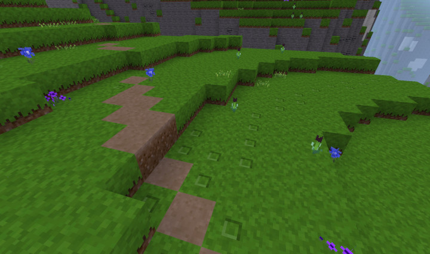

This mod makes soil and soil-like nodes capable of holding temporary "footprint" impressions, and if they're walked on repeatedly turning into hard-packed trails.

It also allows players to flatten plants by walking on them.

It includes definitions for footprint-capable nodes in the "default" mod, and has an API for allowing nodes in other mods to use the same system.

## API

New trampled nodes can be registered with this API:

```
footprints.register_trample_node(trampleable_node_name, trample_def)

trample_def:
{
	trampled_node_name = , -- If this is not defined it defaults to the
	                       -- trampleable node name with "_trampled" appended.
	trampled_node_def_override = {}, -- If trampled_node_name doesn't exist a new
	                       -- node will be registered based on the definition of
	                       -- trampleable_node_name. Any properties in this table
	                       -- will be used to override properties. Ignored if
	                       -- trampled_node_name is a node that already exists.
	probability = 1, -- chance that stepping on this node will cause it to turn
                           -- into the trampled version (range is 0.0 to 1.0)
	trample_count = 1, -- The number of times this node needs to be stepped on
                           -- (and pass the probability check) to transition to
                           -- the trampled state
	randomize_trampled_param2 = nil, -- if true, sets param2 of trampled node to math.random(0,3)
                           -- This is used for trampled wheat, for example, to randomize the thatch's
						   -- direction.
	erodes = true,         -- sets the trampled node to erode back into the non-trampled
                           -- version over time, if erosion is enabled in this mod's settings.
                           -- Ignored if trampled_node_name is a node that already
                           -- exists, since that may already have an erosion target established.
	add_footprint_overlay = true, -- Applies the footprint texture over the +Y tile of the
                           -- trampleable node. ignored if trampled_node_name is a node that already exists
	footprint_overlay_texture = "footprints_footprint.png",
	footprint_opacity = 64, -- defaults to 64 (0 is transparent, 255 is fully opaque)
	hard_pack_node_name = nil, -- If the trampled node is walked on again this is the
                           -- node that it can get further packed down into. ignored if
                           -- trampled_node_name is a node that already exists, since
                           -- it's expected this has already been established
	hard_pack_probability = 0.9, -- The probability that walking on a trampled node
                           -- will turn it into the hard-packed node (0.0 to 1.0).
                           -- ignored if trampled_node_name is a node that already exists
	hard_pack_count = 10, -- The number of times the trampled node needs to be stepped on
                           -- (and pass the probability check) to turn to the hard packed state
}
```

Note that all of the parameters in trample_def have default values, so if you want you can just pass in nil and the footprints mod will create a footstep-marked version of the node and set it all up for you with no further information needed. "footprints.register_trample_node("modname:dirt")" will work.

### Eroding hardpack back to soil over time

If you've defined a hard_pack_node and want to have it able to erode back to base soil, you can use this callback to manually add it to the erosion system:

```
footprints.register_erosion(starting_node_name, restored_node_name)
```
Note that the source_node should be in group footprints_erodes or an error will be thrown.

### Using a hoe to convert hardpack back to soil

If you've got the `farming` mod installed you can allow hardpack nodes to be restored back to soil using a hoe with the following function:

```
footprints.register_hoe_converts(starting_node_name, restored_node_name)
```

## License

Licenses: Source code MIT. Textures CC BY-SA (3.0)

- This mod was developed by paramat from 'desire path' mod by Casimir: https://forum.minetest.net/viewtopic.php?id=3390
- Trail 0.3.1 by paramat: https://forum.minetest.net/viewtopic.php?f=11&t=6773
- Version 0.4 for Minetest 0.5 was developed by FaceDeer and renamed "footprints"
